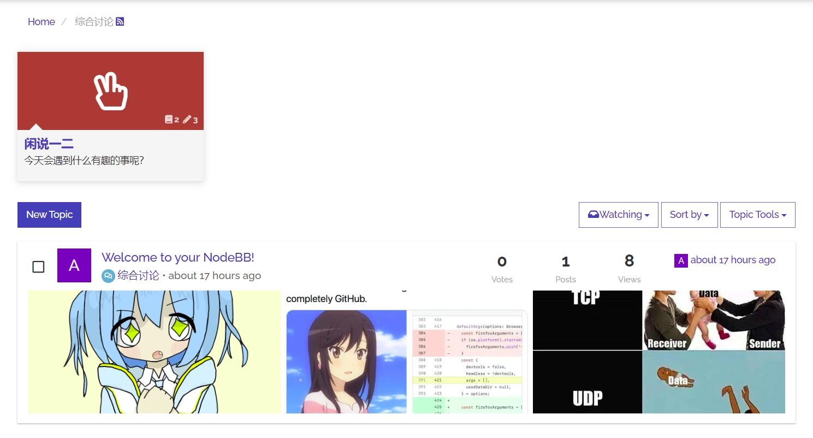

# nodebb-plugin-teaser-images

API added `images` list in content. 4 urls limited.
```json5
    "teaser": {
        "pid": 114514,
        "uid": 1919,
        "timestamp": 0,
        "tid": 810,
        "content": "image1alt image2alt image3alt image4alt",
        // I added this, so you can add image preview into teaser
        "images": [
            "image1url",
            "image2url",
            "image3url"
        ]
    }
```

To add image preview under topic, edit those in template:

topic_list.tpl
```html
					<div class="row">
						<!-- IF topics.teaser.images.length -->
						<a href="{config.relative_path}/topic/{topics.slug}">
							<div class="teaser-images">
								{{{ each topics.teaser.images }}}
									<div class="image-container">
										
									</div>
								{{{ end }}}
							</div>
						</a>
						<!-- ENDIF topics.teaser.images.length -->
					</div>
```

style
```css
.teaser-images {
	display: flex;
    align-items: center;
    justify-content: center;
	margin-bottom: 10px;

	.image-container {
		width: 33%;
		height: 180px;
		justify-content: center;
		overflow: hidden;

		img {
			width: 100%;
			height: auto;
			position: relative;
            top: 50%;
            left: 50%;
            -webkit-transform: translate(-50%, -50%);
            -moz-transform: translate(-50%, -50%);
            -ms-transform: translate(-50%, -50%);
            -o-transform: translate(-50%, -50%);
            transform: translate(-50%, -50%);
		}
	}
}
```


